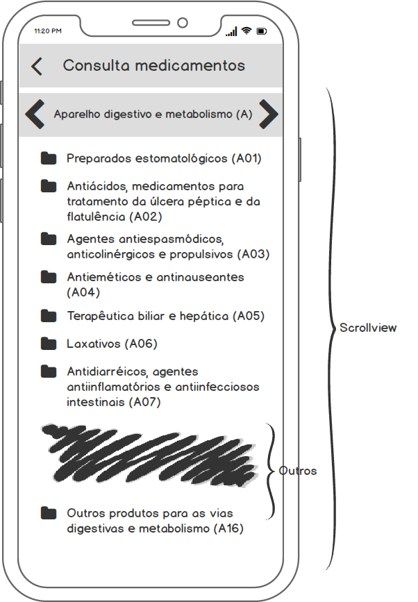
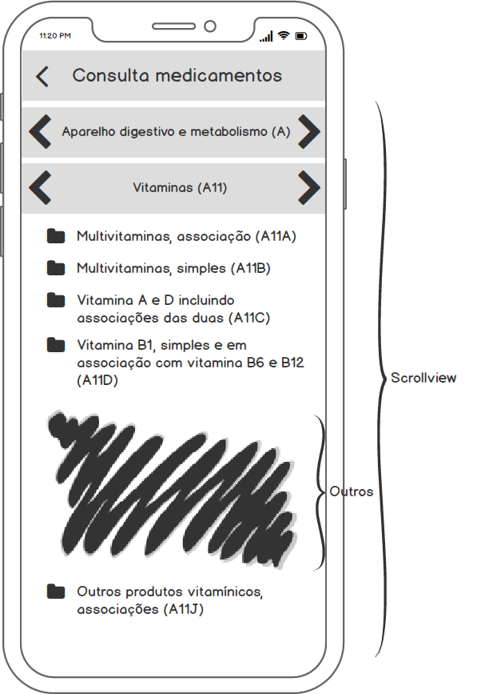
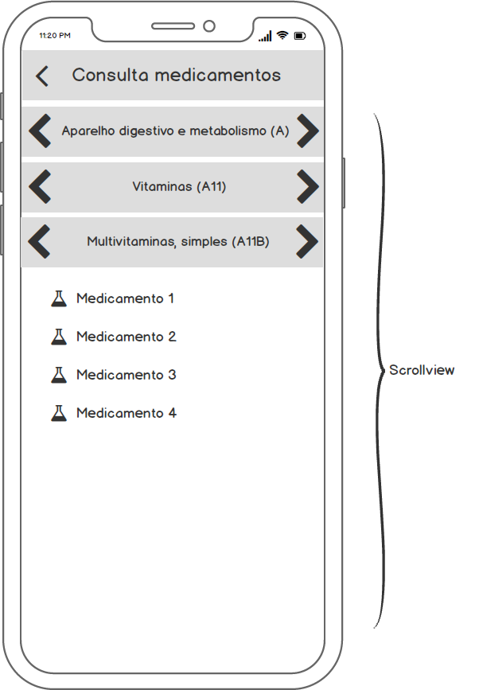
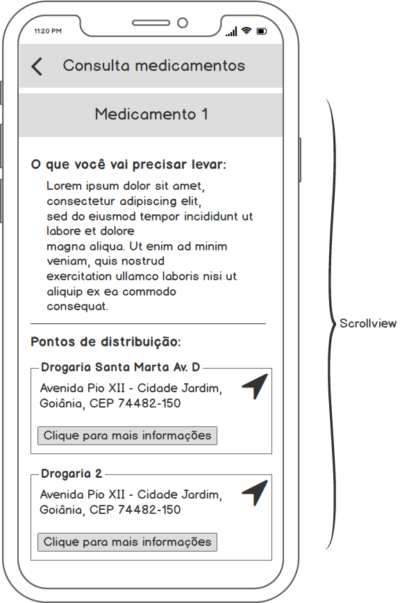
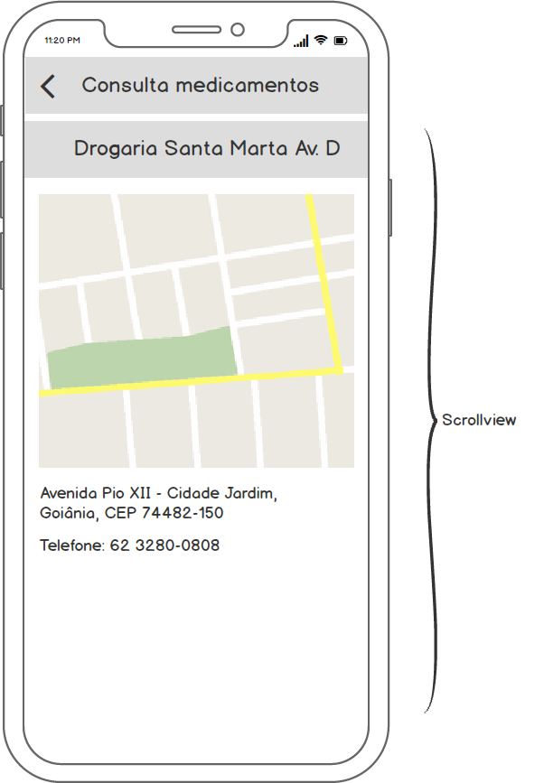

# Consulta a medicamentos

“Consulta Medicamentos” (nome provisório) é um sistema de informação que facilita o acesso a informações sobre fármacos, em particular, os requisitos para acesso (exigências) e o local onde estão disponíveis. Inicialmente, esta solução é proposta para o escopo específico do município de Goiânia (Goiás). 

# Wireframe
## Mobile

