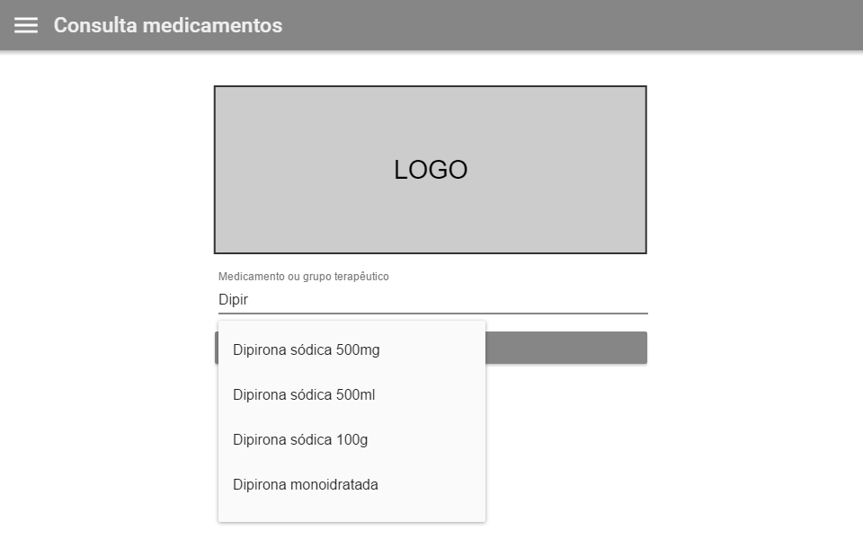

- "Local de referência" foi estranho no primeiro momento. Primeiro, de tudo, seria o fármaco, DEPOIS, alguma orientação sobre a localização. Observe que há opções: nenhuma preferência (talvez listar em ordem alfabética), mais perto de onde estou e mais perto de algum lugar. Talvez ainda exista outro cenário. 

